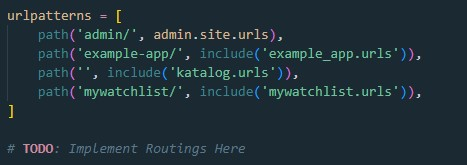
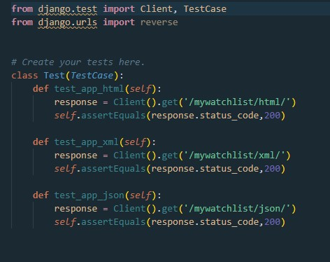

# Tugas 3: Pengimplementasian Data Delivery Menggunakan Django

Dipa Alhaza (NPM 2106751543)

lINK Deploy :

HTML = [https://tugas2pbp-dipa.herokuapp.com/mywatchlist/html/](https://tugas2pbp-dipa.herokuapp.com/mywatchlist/html/)

XML = [https://tugas2pbp-dipa.herokuapp.com/mywatchlist/xml/](https://tugas2pbp-dipa.herokuapp.com/mywatchlist/xml/)

JSON = [https://tugas2pbp-dipa.herokuapp.com/mywatchlist/json/](https://tugas2pbp-dipa.herokuapp.com/mywatchlist/json/)

## Perbedaan antara JSON, XML, dan HTML!

JSON menyimpan semua datanya dalam format map (key / value) yang rapi dan lebih mudah untuk dipahami. Banyak orang yang berpendapat JSON secara perlahan menggantikan XML karena beberapa kelebihan seperti kemudahan pemodelan data atau pemetaan langsung ke objek domain, lebih dapat diprediksi dan mudah untuk memahami strukturnya. Tetapi ada juga developers yang telah menggunakan keduanya tidak sepenuhnya setuju dengan ini. JSON digunakan untuk menyimpan informasi dengan cara yang terorganisir dan mudah diakses. Bentuk lengkapnya adalah JavaScript Object Notation. Ini menawarkan kumpulan data yang dapat dibaca manusia yang dapat diakses secara logis. Ekstensi file JSON adalah .json.

XML (_eXtensible Markup Language_) adalah bahasa markup yang dirancang untuk menyimpan data. Ini populer digunakan atau transfer data. Case sensitive pada huruf besar/kecil. XML menawarkan untuk menentukan elemen markup dan menghasilkan bahasa markup yang disesuaikan. Unit dasar dalam XML dikenal sebagai elemen.Ekstensi file XML adalah .xml.

_HyperText Markup Language_, atau HTML, adalah bahasa markup standar untuk dokumen yang dirancang untuk menjadi ditampilkan di browser web. Markup Language adalah sebuah sistem (seperti HTML atau SGML) untuk menandai atau menandai dokumen yang menunjukkan struktur logisnya (seperti paragraf) dan memberikan instruksi untuk tata letaknya pada halaman khususnya untuk transmisi dan tampilan elektronik.


## Jelaskan mengapa kita memerlukan data delivery dalam pengimplementasian sebuah platform?
Dalam pengembangan suatu platform, tentunya tidak lepas dari proses pengiriman data. distribusi data ini terjadi antara client dan server. jenis data yang dikirimkan juga bermacam-macam, seperti HTML,XML, dan JSON. oleh karena itu, platform perlu mengimplementasikan data delivery agar proses pengambilan atau request terhadap data ke server lebih teratur dan lancar.


## Jelaskan bagaimana cara kamu mengimplementasikan checklist di atas.

1. Membuat Apps Django
```shell
python manage.py startapp mywatchlist
```
2. Buka settings.py di folder project_django dan tambahkan aplikasi wishlist ke dalam variabel INSTALLED_APPS untuk mendaftarkan django-app yang sudah  dibuat ke dalam proyek Django. Contohnya adalah sebagai berikut.


3. membuat sebuah folder bernama fixtures di dalam folder aplikasi `mywatchlist` dan membuat sebuah berkas bernama initial_mywatchlist_data.json yang berisi sebagai berikut.


4. Buka file `models.py` yang ada di folder `mywatchlist` dan tambahkan potongan kode berikut.


5. Lakukan perintah `python manage.py makemigrations` untuk mempersiapkan migrasi skema model ke dalam database Django lokal.

6. Jalankan perintah `python manage.py migrate` untuk menerapkan skema model yang telah dibuat ke dalam database Django lokal.

7. Jalankan perintah `python manage.py loaddata initial_mywatchlist_data.json` untuk memasukkan data tersebut ke dalam database Django lokal.

8. Buka `views.py` yang ada pada folder `mywatchlist` dan buat sebuah fungsi yang menerima parameter request. hasil akhirnya sebagai berikut. fungsi ini berfungsi unutk mengarahkan atau mengembalikan data ke temapilan berbentuk HTML, XML , dan JSON


9. Tambahkan path `url` ke dalam `urlpatterns` di `urls.py` (di folder mywatchlist dan folder project_django) untuk mengakses fungsi yang sudah dibuat tadi. berikut contoh code




11. membuat testing urls pada `test.py`, dengan kode sebagai berikut



12. Selesai.

## POSTMAN  _screenshot_
1. HTML

2. JSON

3. XML


