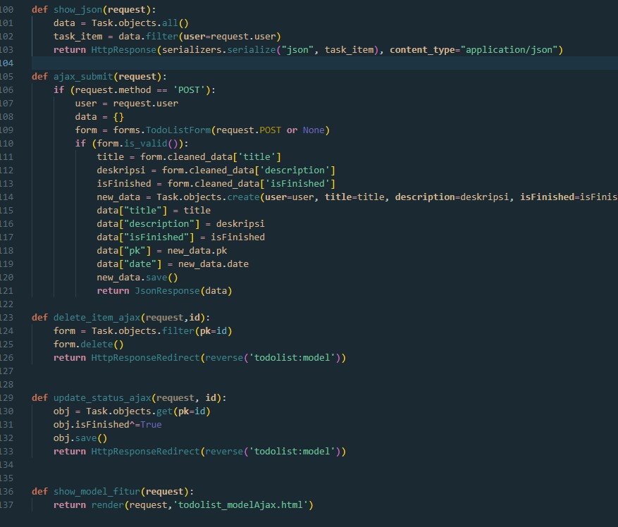
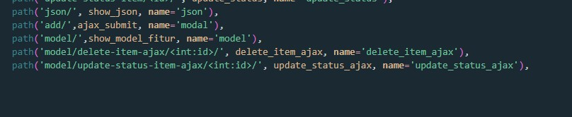
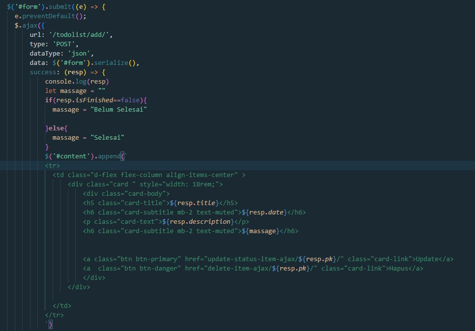

# Tugas 6: Javascript dan AJAX

## Jelaskan perbedaan antara asynchronous programming dengan synchronous programming.
Asynchronous programming merupakan sebuah pendekatan pemrograman yang tidak terikat pada input output (I/O)  protocol. Ini menandakan bahwa pemrograman asynchronous tidak melakukan pekerjaannya secara old style / cara lama yaitu dengan eksekusi baris program satu persatu secara hirarki. Asynchronous programming melakukan pekerjaannya tanpa harus terikat dengan proses lain atau dapat kita sebut secara Independent.

Synchronous programming memiliki pendekatan yang lebih old style. Task akan dieksekusi satu persatu sesuai dengan urutan dan prioritas task. Hal ini memiliki kekurangan pada lama waktu eksekusi karena masing-masing task harus menunggu task lain selesai untuk diproses terlebih dahulu.

## paradigma Event-Driven Programming.

_Event-Driven Programming_ adalah salah satu teknik pemogramman yang konsep kerjanya tergantung dari kejadian atau event tertentu.

Komponen pemograman berbasis event (Event-Driven Programming) 
1. Event
Event / kejadian adalah sebuah aksi yang muncul pada sebuah sistem.Kejadian atau aksi ini bisa dipicu oleh penekanan tombol mouse,penekanan sebuah tombol keyboard atau timer

2. Trigger
Trigger adalah sebuah fungsi yang mempunyai kesesuaian dengan kejadian. Tujuannya dari Trigger tidak lain adalah sebagai atau untuk memicu komponen `event handler`.

3. EventHandler
Event Handler adalah komponen yang melakukan aksi ketika terjadi sebuah event.

4. EventLoop
Event Loop berfungsi mencari event-event yang ada pada sebuah sistem berbasis event. Proses event loop berlangsung secara terus menerut (loop), sampai sebuah aksi atau event muncul yang mengakhiri proses event loop tersebut.

## Penerapan asynchronous programming pada AJAX.

Pada Javascript, Asynchronous JavaScript and XMLHTTP atau biasa disebut AJAX merupakan salah satu konsep yang menerapkan metode asynchronous dalam menjalankan pekerjaannya. Biasa nya AJAX digunakan untuk melakukan permintaan data (request) dan menangani sebuah tanggapan (handling response), baik response dalam bentuk XML, Javascript ataupun JSON dari sebuah Rest API. AJAX atau Asynchronous JavaScript and XML adalah teknik yang digunakan untuk membuat website yang dinamis. Artinya website mampu mengupdate dan menampilkan data baru dari server tanpa perlu melakukan reload. 

cara kerja AJAX: 

1 Browser akan memanggil AJAX javascript untuk mengaktifkan XMLHttpRequest dan mengirimkan HTTP Request ke server. 

2. XMLHttpRequest dibuat untuk proses pertukaran data di server secara asinkron.

3. Server menerima, memproses, dan mengirimkan data kembali ke browser.  

4. Browser menerima data tersebut dan langsung ditampilkan di halaman website, tanpa perlu reload atau membuat halaman baru. 

## Cara Implementasi

1. membuat file html baru yang bernama `todolist_modelAjax.html` untuk membuat yang dilengkapi fitur form pada modal

2. membuat fungsi pada `views.py`, berikut merupakan fungsi yang dibuat

3. menambahkan path di `url.py`, berikut path yang ditambahkan

4.  membuat dan mengedit isi laman pada `todolist_modelAjax.html`

5. untuk implementasi asinkronus ajax, program di kombinasi dengan memanfaatkan jQuery.

Berikut merupakan kode untuk mengimplementasi ajax get (mengambil data json) pada url yung tercantum

Berikut merupakan implementasi ajax post dan sekaligus implementasi asinkronus ajax (menampilkan kembali data yang di buat secara langsung pada elemen html tujuan)

6. Selesai

