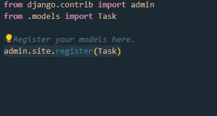

Dipa Alhaza (NPM 2106751543)

LINK Deploy :

Login page: [https://tugas2pbp-dipa.herokuapp.com/todolist](https://tugas2pbp-dipa.herokuapp.com/todolist)

Register page page : [https://tugas2pbp-dipa.herokuapp.com/todolist/register/](https://tugas2pbp-dipa.herokuapp.com/todolist/register/)

Add task page : [https://tugas2pbp-dipa.herokuapp.com/todolist/create-task/](https://tugas2pbp-dipa.herokuapp.com/todolist/create-task/)


# Tugas 4: Pengimplementasian Form dan Autentikasi Menggunakan Django

## Apa kegunaan  pada elemen <form>? Apa yang terjadi apabila tidak ada potongan kode tersebut pada elemen <form>?
Token CSRF adalah token acak yang aman (misalnya, token sinkronisasi atau token tantangan) yang digunakan untuk mencegah serangan CSRF. Token harus unik per sesi pengguna dan harus bernilai acak besar agar sulit ditebak. Sebuah _CSRF secure application_ memberikan token CSRF unik untuk setiap sesi pengguna. Token ini dimasukkan ke dalam parameter tersembunyi dari formulir HTML yang terkait dengan operasi sisi server yang penting. Mereka kemudian dikirim ke browser klien.

Token CSRF dapat mencegah serangan CSRF dengan membuat penyerang tidak mungkin membuat permintaan HTTP yang sepenuhnya valid yang cocok untuk diumpankan ke pengguna korban.

CSRF (_Cross-Site Request Forgery_) adalah sebuah serangan yang membuat pengguna internet  tanpa sadar mengirimkan request (permintaan) kepada suatu aplikasi website melalui aplikasi website yang sedang digunakan. Sehingga, aplikasi tersebut mengeksekusi suatu tindakan yang sebenarnya tidak dikehendaki oleh pengguna internet. Misalnya mengganti foto profil Anda menjadi gambar bebek, menghapus akun secara permanen, atau metransfer uang ke suatu akun. 

## Apakah kita dapat membuat elemen <form> secara manual (tanpa menggunakan generator seperti {{ form.as_table }})? 

Kita dapat membuat `form` secara manual tanpa harus menggunakan form.as_table dengan memanfaatkan fitur yang `form` yang ada pada `HTML`.

##  Penjelasan proses alur data dari submisi yang dilakukan oleh pengguna melalui HTML form, penyimpanan data pada database, hingga munculnya data yang telah disimpan pada template HTML.\

1. Pengguna memasukan input melalui laman html, dengan fitur `form` django
2. ketika user submit, maka form akan memberikan perintah `POST` yang bisa kita gunakan sebagai sinyal untuk mengirim data input ke database
2. Data yang dimasukan akan diarahkan sesuai `models` yang dibuat ke database dengan menggunakan fungsi atau method bawaan fitur `form` di django
3. untuk data yang sudah dimasukan ke database, kita dapat membuat fungsi yang mengambil data berdasarkan ketentuan yang dibutuhkan (misal pada program ini, data ditampilkan sesuai dengan user yang login) juga berdasarkan `models` yang dibuat.
4. proses logic memasukan atau menampilkan data tersebut terjadi di `views.py`


## Jelaskan bagaimana cara kamu mengimplementasikan checklist di atas.

1. Membuat Apps Django
```shell
python manage.py startapp todolist
```
2. Membuat sebuah model di `model.py` seperti berikut.


3. Lakukan perintah `python manage.py makemigrations` untuk mempersiapkan migrasi skema model ke dalam database Django lokal.

4. Jalankan perintah `python manage.py migrate` untuk menerapkan skema model yang telah dibuat ke dalam database Django lokal.

5. meregistrasi models ke admin site django. berikut kodenya.



5. membuat laman login, register (sesuai dengan tutorial `lab 3` berupa html), todolist, dan create-task s file di folder Template.

6. Membuat file baru bernama `forms.py` membuat sebuah class yang meng-inhirit ModelsForm untuk membuat custom form django. berikut representasi kodenya.


7. membuat fungsi register, login, dan logout sebagai berikut


fungsi register -> Untuk membuat sebuah regular akun
fungsi login -> Untuk melakukan login + validasi user login (data user yang login akan di store ke Cookies)
fungsi logout -> untuk keluar dari userlogin


8. membuat fungsi `show_todolist` untuk mengatur tampilan laman yang berisikan todolist user yang login dan fungsi `create-task` untuk mengatur form masukan berupa info task yang kemudian di store ke database. representasi kodenya sebagai berikut.


9. membuat fungsi fitur tambahan (bonus) yaitu fungsi `delete_item` untuk menghapus task dan `update_status` untuk membuat perubahan pada status sudah atau belum task dikerjakan.
berikut representasi kodenya.


10. mengatur url path di `urls.py`, berikut kodenya.


11. Program di push ke github dan deploy ke heroku


